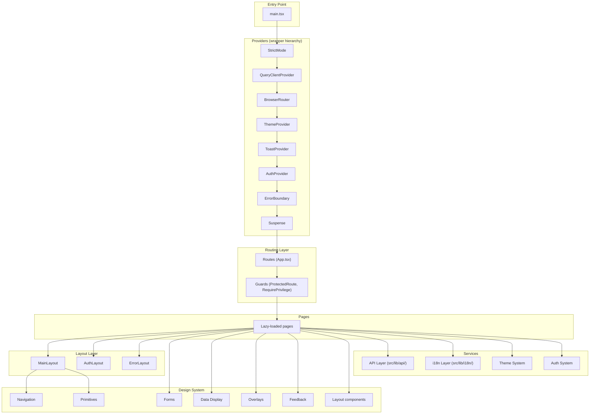
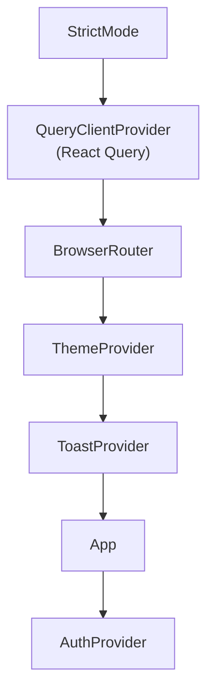
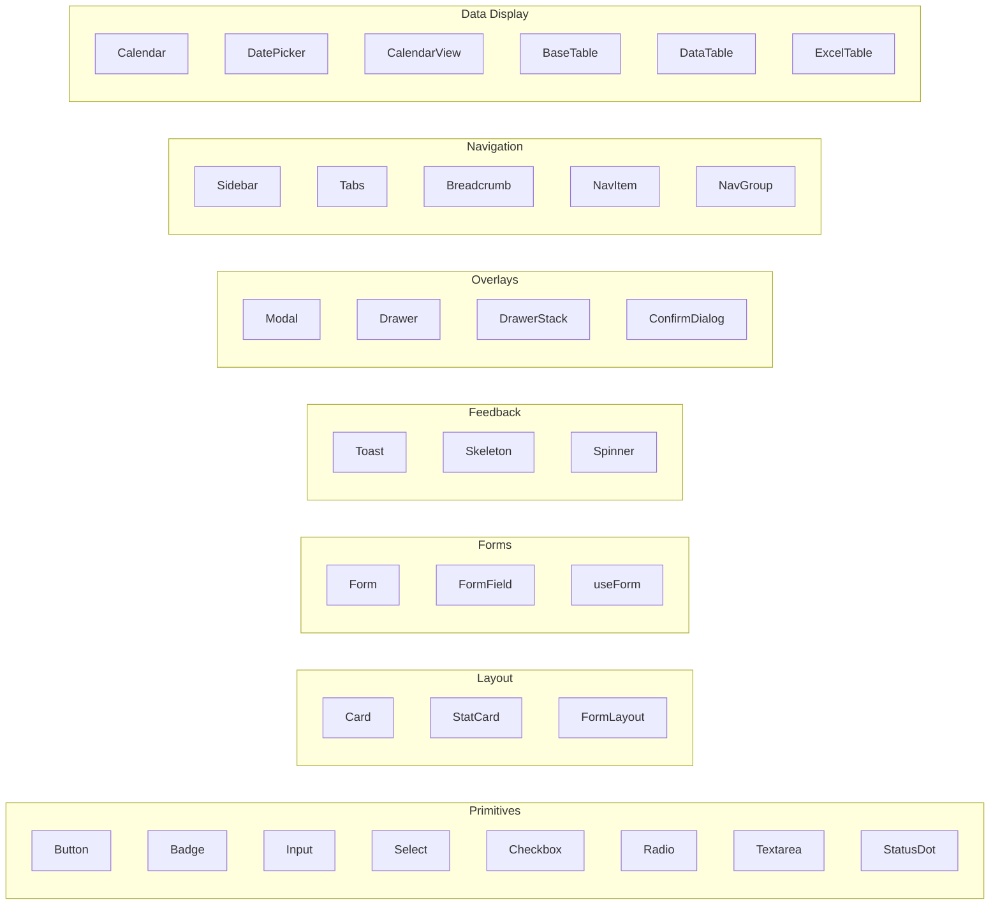
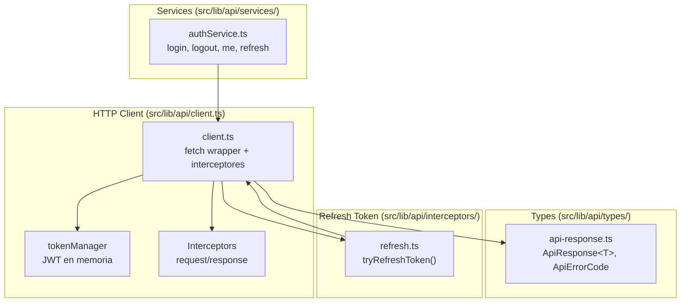
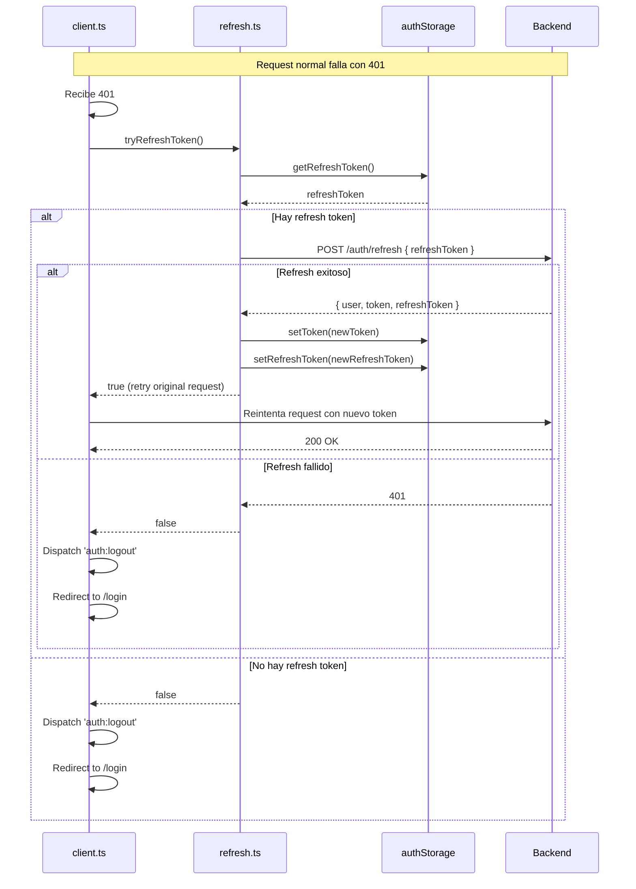
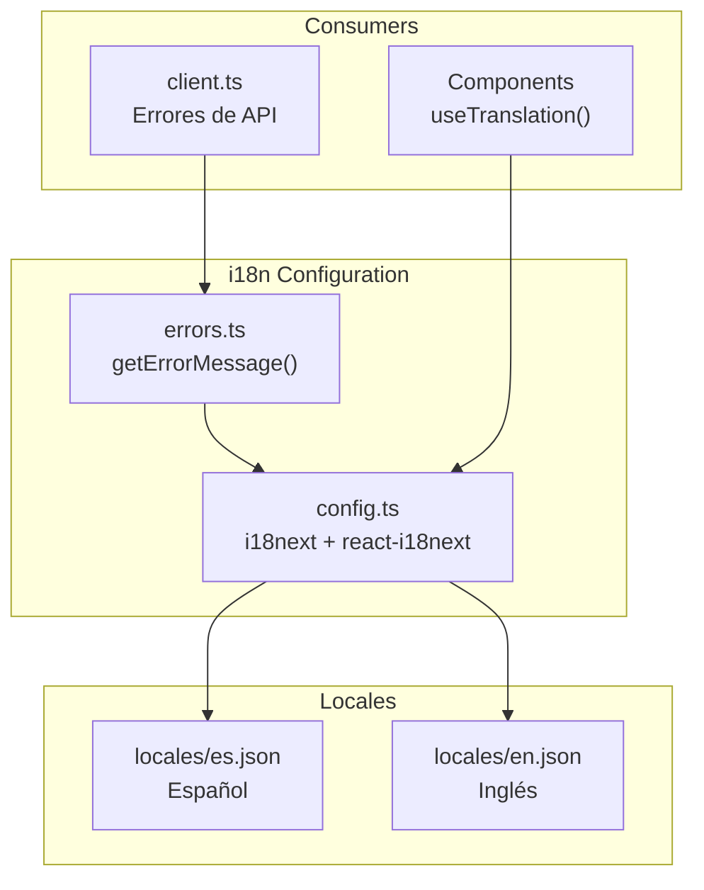
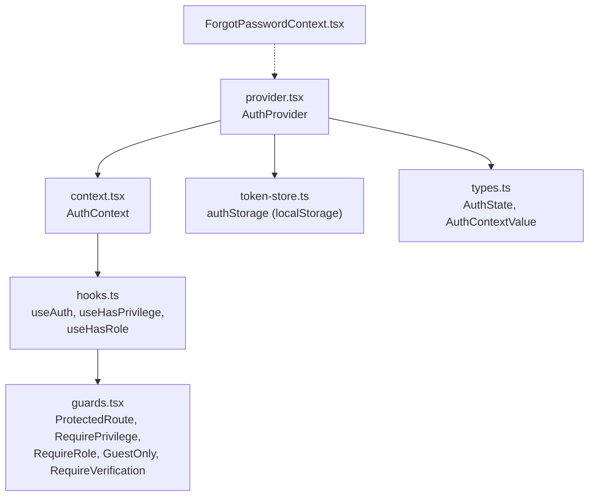

# Arquitectura — Plantilla Front

## Visión general

La aplicación sigue una arquitectura **component-driven** con separación por dominios (auth, theme, routes, components). No hay framework meta (Next, Remix); es un SPA client-side con React Router.



## Capas de la aplicación

### 1. Provider Hierarchy (`src/main.tsx`)

El orden de los providers es **crítico** y no debe cambiarse sin revisar dependencias:



**¿Por qué `AuthProvider` dentro de `App`?** Porque necesita acceso a `react-router` para redirigir en 401/403.

### 2. Routing (`src/routes/`)

Las rutas se agrupan por dominio en archivos separados:

| Archivo | Dominio | Rutas |
|---------|---------|-------|
| `showcase.tsx` | Componentes UI | `/`, `/componentes/*` |
| `ajustes.tsx` | Configuración | `/ajustes/*` |
| `examples.tsx` | Ejemplos reales | `/examples/*` |

Se combinan en `src/routes/index.ts` y se importan en `App.tsx`.

### 3. Design System (`src/components/`)

Organizado bajo el patrón **Atomic Design simplificado**:



### 4. Capa de Servicios



#### HTTP Client (`src/lib/api/client.ts`)

- **`tokenManager`**: Gestión de token en memoria (get/set/clear). Se sincroniza con `authStorage` para persistencia.
- **`ApiError`**: Clase de error personalizada con `status`, `statusText` y `data`.
- **`request<T>()`**: Función interna que ejecuta peticiones con inyección automática de JWT, interceptores y manejo de 401/403.
- **`client`**: API pública con métodos `get`, `post`, `put`, `patch`, `delete`.
- **`configureClient()`**: Permite cambiar config runtime (baseUrl, callbacks).

#### Auth Service (`src/lib/api/services/auth.service.ts`)

Servicio que encapsula llamadas HTTP de autenticación:

| Método | Endpoint | Descripción |
|--------|----------|-------------|
| `login(email, password)` | POST `/auth/login` | Iniciar sesión |
| `logout()` | POST `/auth/logout` | Cerrar sesión |
| `me()` | GET `/auth/me` | Obtener perfil |
| `refreshToken(refreshToken)` | POST `/auth/refresh` | Renovar access token |
| `register(data)` | POST `/auth/register` | Registrar usuario |
| `forgotPassword(email)` | POST `/auth/forgot-password` | Solicitar recuperación |
| `resetPassword(token, password)` | POST `/auth/reset-password` | Establecer nueva contraseña |
| `verifyEmail(token)` | POST `/auth/verify-email` | Verificar email |
| `resendVerification(email)` | POST `/auth/resend-verification` | Reenviar verificación |

#### Refresh Token Flow



### 5. i18n Layer (`src/lib/i18n/`)



#### Configuración (`src/lib/i18n/config.ts`)

- Inicializa i18next con `initReactI18next`
- Idioma por defecto: español (`es`)
- Persiste idioma seleccionado en `localStorage` (`i18n_lang`)
- Fallback a español si el idioma seleccionado no existe

#### Errores (`src/lib/i18n/errors.ts`)

- Mapea códigos de error API (`ApiErrorCode`) a claves de traducción
- `getErrorMessage(code)` retorna el mensaje traducido
- Usado por `client.ts` para errores de red y HTTP

### 6. Auth System (`src/auth/`)



### 7. Token Store (`src/lib/auth/token-store.ts`)

Gestión de persistencia de tokens:

| Key en localStorage | Descripción |
|---------------------|-------------|
| `auth_token` | JWT de acceso |
| `auth_refresh_token` | JWT de refresco |
| `auth_expires_at` | Timestamp de expiración |

Todas las operaciones están envueltas en try/catch para manejar localStorage lleno o deshabilitado.

## Patrones de diseño aplicados

### Compound Components

Componentes que se componen con sub-componentes internos:

```tsx
// Modal
<Modal isOpen onClose={close}>
  <Modal.Header title="Título" />
  <Modal.Body>Contenido</Modal.Body>
  <Modal.Footer>Acciones</Modal.Footer>
</Modal>

// Sidebar
<Sidebar>
  <Sidebar.Header>...</Sidebar.Header>
  <Sidebar.Toggle />
  <Sidebar.Nav>...</Sidebar.Nav>
  <Sidebar.Footer>...</Sidebar.Footer>
</Sidebar>

// Input (compound)
<Input.Root>
  <Input.StartAddon>@</Input.StartAddon>
  <Input.Control placeholder="email" />
  <Input.EndAdornment>.com</Input.EndAdornment>
</Input.Root>
```

### Guard Pattern

Los guards se componen jerárquicamente en `App.tsx`:

```tsx
<Route element={<ProtectedRoute><MainLayout /></ProtectedRoute>}>
  {routes.map(r =>
    r.path.startsWith('/ajustes')
      ? <RequirePrivilege privilege="settings:manage">{r.element}</RequirePrivilege>
      : r.element
  )}
</Route>
```

### Imperative API via Module-Level State

El sistema de Toast usa un patrón no usual: el `ToastProvider` registra una API en un closure de nivel módulo (`src/components/feedback/useToast.ts`), permitiendo llamar `toast.success()` desde cualquier componente sin prop drilling.

### Lazy Loading con Code Splitting

Todas las páginas usan `React.lazy()` + `Suspense` en `App.tsx`. Las rutas se cargan bajo demanda.

## Decisiones arquitectónicas clave

| Decisión | Elección | Alternativa descartada | Razón |
|----------|----------|----------------------|-------|
| CSS approach | Tailwind v4 CSS-first + CSS Modules legacy | styled-components, CSS-in-JS | Tailwind v4 permite CSS-first config sin JS runtime |
| Router | React Router v8 | TanStack Router, Wouter | Ecosistema maduro, soporte lazy loading nativo |
| State management | React Context + useState | Redux, Zustand, Jotai | App con pocos estados globales; Context es suficiente |
| Formularios | Custom `useForm` hook | React Hook Form, Formik | Control total, sin dependencias externas |
| Storybook | Storybook 10 | Lad, Histoire | Ecosistema más amplio, addons de a11y y docs |
| Linting | Oxlint | ESLint, Biome | Velocidad (Rust-based), suficiente para el proyecto |
| Dark mode | `prefers-color-scheme` | Manual toggle | Pendiente migrar a `data-theme` |
| API client | Custom fetch wrapper | Axios, ky | Control total, interceptores, sin dependencias extra |
| i18n | i18next + react-i18next | react-intl, FormatJS | Ecosistema maduro, lazy loading de traducciones |
| Server state | React Query | SWR, custom hooks | Cache, refetch, mutations integradas |

## Rutas / demos

| Ruta | Renderiza | Auth |
|------|-----------|------|
| `/`, `/componentes` | Índice de componentes | ✅ |
| `/componentes/botones` | Showcase de botones | ✅ |
| `/componentes/cards` | Showcase de cards | ✅ |
| `/componentes/tablas` | TablesShowcase | ✅ |
| `/componentes/formularios` | FormShowcase | ✅ |
| `/componentes/modales` | Showcase de modales | ✅ |
| `/componentes/notificaciones` | Showcase de toasts | ✅ |
| `/componentes/navegacion` | Showcase de tabs/breadcrumbs/sidebar | ✅ |
| `/componentes/calendario` | Showcase de calendario | ✅ |
| `/calendario` | Demo de calendario docente | ✅ |
| `/ajustes` | Índice de ajustes | ✅ + settings:manage |
| `/ajustes/colores` | Editor de colores de marca | ✅ + settings:manage |
| `/auditoria` | App de ejemplo con DataTable | ✅ |
| `/login` | Página de login | ❌ (GuestOnly) |
| `/register` | Página de registro | ❌ (GuestOnly) |
