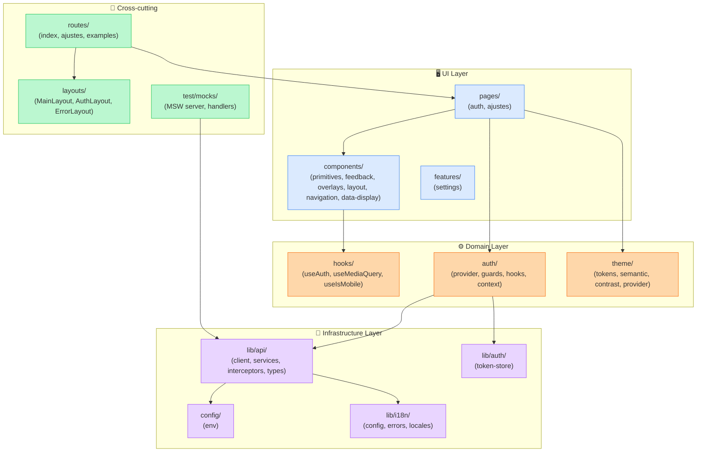
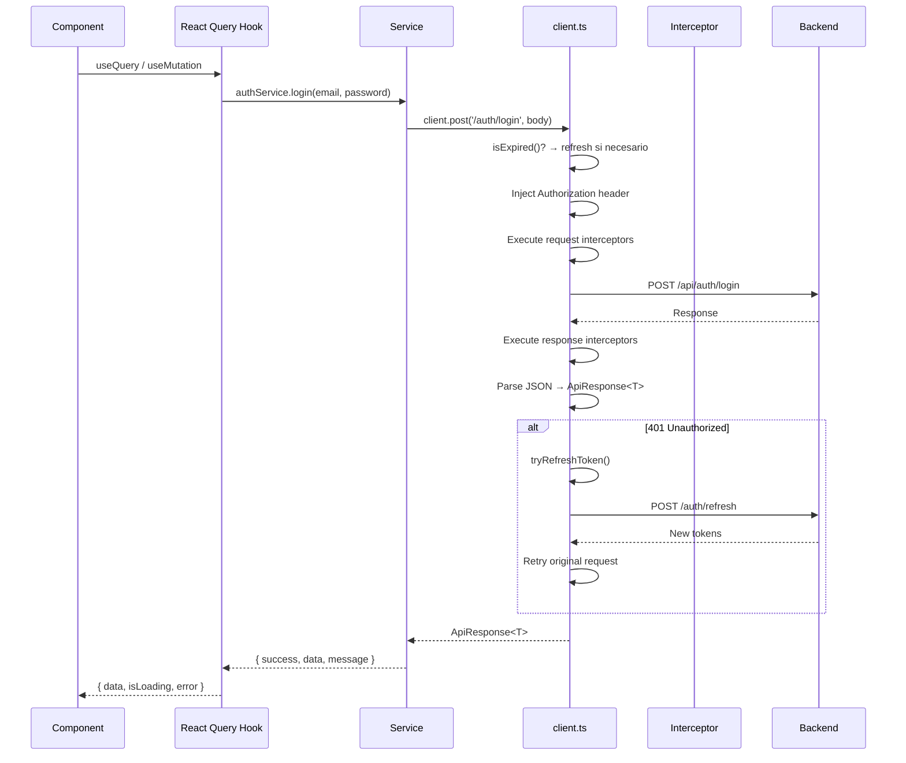

# Arquitectura

## Diagrama de capas

## Flujo de una petición

## Tabla de responsabilidades

| Capa | Archivos | Responsabilidad |
|------|----------|-----------------|
| **UI** | `pages/`, `components/` | Renderizado, interacción del usuario |
| **Domain** | `auth/`, `theme/`, `hooks/` | Lógica de negocio, estado de aplicación |
| **Infrastructure** | `lib/api/`, `lib/auth/`, `lib/i18n/`, `config/` | Comunicación externa, persistencia |
| **Cross-cutting** | `routes/`, `layouts/`, `test/mocks/` | Navegación, estructura visual, testing |

## Decisiones arquitectónicas

1. **Fetch nativo con wrapper** — No Axios. `client.ts` abstrae fetch con interceptores, timeout, y refresh automático.
2. **React Query para server state** — No SWR. `@tanstack/react-query` para caching, dedup, y lifecycle.
3. **Auth centralizado** — `AuthProvider` + `GuestOnly`/`ProtectedRoute` guards. Token en memoria + localStorage.
4. **Tailwind CSS** — Utility-first con CSS Modules para casos complejos (table, sidebar).
5. **MSW para tests** — Mock Service Worker en tests unitarios. No se testea contra backend real.
6. **Storybook para documentación visual** — Cada primitive tiene stories con interacciones.
