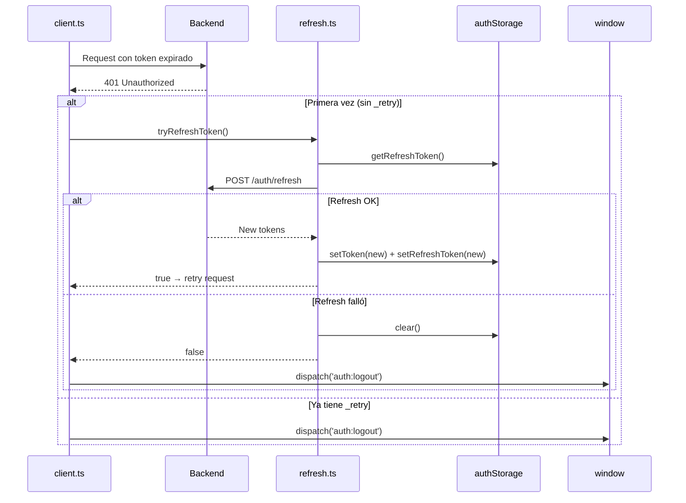
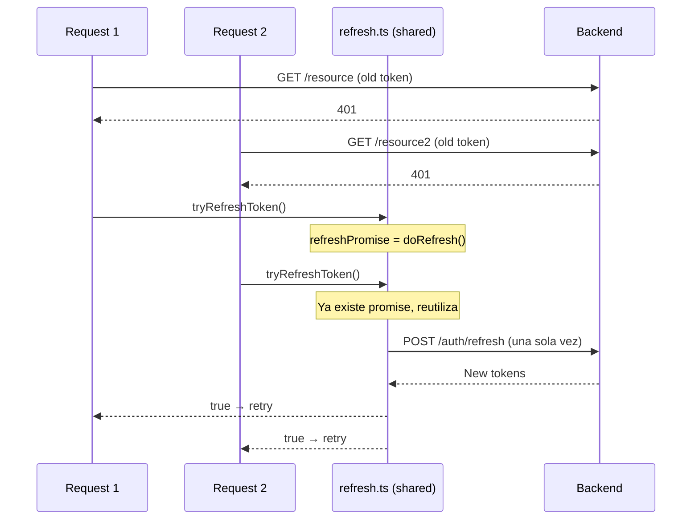

# Autenticación

## Diagrama de flujo de login

```mermaid
sequenceDiagram
    U as Usuario
    LP as LoginPage
    AP as AuthProvider
    AS as authService
    C as client.ts
    TS as authStorage
    API as Backend

    U->>LP: Email + password
    LP->>AP: login(email, password, remember)
    AP->>AS: authService.login()
    AS->>C: client.post('/auth/login', body)
    C->>API: POST /auth/login
    API-->>C: { user, token, refreshToken, expiresIn }
    C-->>AS: ApiResponse<AuthResponse>
    AS-->>AP: { success, data }
    AP->>TS: setToken(token, expiresIn, remember)
    AP->>TS: setRefreshToken(refreshToken, remember)
    AP->>AP: setState({ user, isAuthenticated: true })
    AP-->>LP: Estado actualizado
    LP->>U: Navigate to / or previous route
```

## Diagrama de refresh token



## Diagrama de refresh concurrente



## Guards

| Guard | Comportamiento |
|-------|----------------|
| `ProtectedRoute` | Requiere auth. Sin auth → `/login`. Sin verificación → `/verify-email`. |
| `GuestOnly` | Solo visitantes. Con auth → `/`. |
| `RequirePrivilege` | Requiere privilegio. Sin auth → `/login`. Sin permiso → `/403`. |
| `RequireRole` | Requiere rol. Sin auth → `/login`. Sin rol → `/403`. |
| `RequireVerification` | Requiere email verificado. Sin auth → `/login`. Sin verificar → `/verify-email`. |

## Cómo añadir un nuevo flujo de auth

1. Crear componente en `src/pages/auth/`
2. Agregar ruta en `src/App.tsx`
3. Envolver con `GuestOnly` si es ruta pública
4. Agregar handler MSW en `src/test/mocks/handlers/auth.ts`
5. Agregar servicio en `src/lib/api/services/auth.service.ts`
6. Agregar tests
7. Actualizar diagramas
