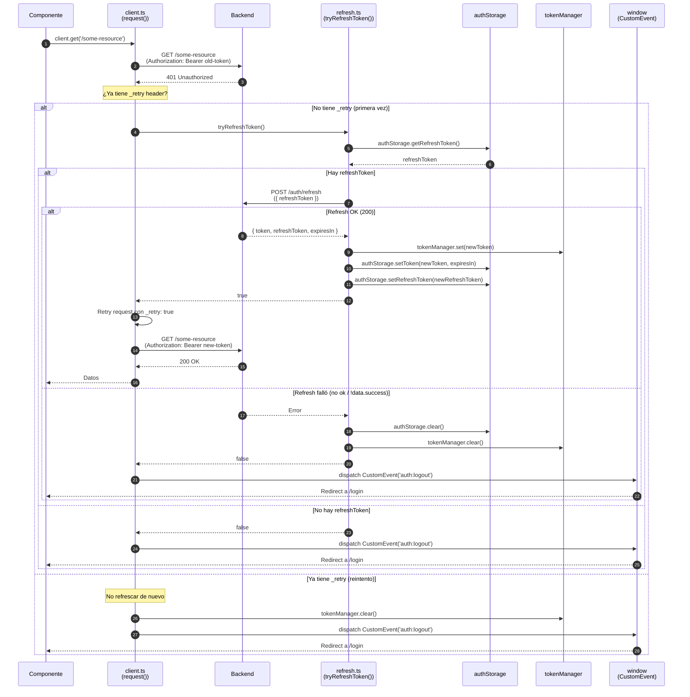
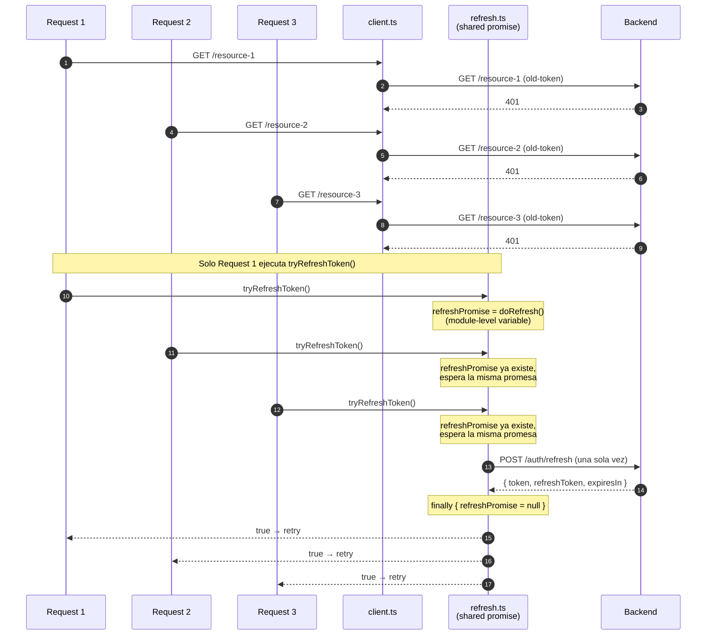
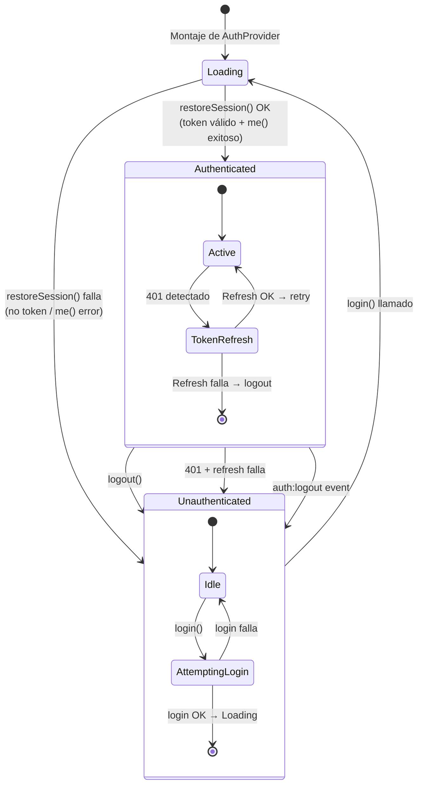
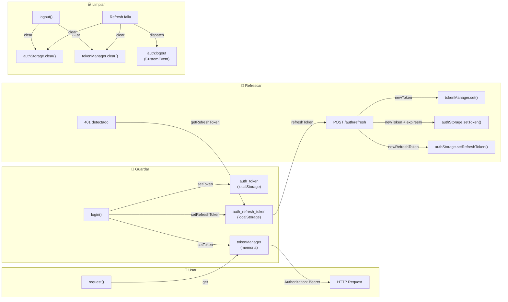
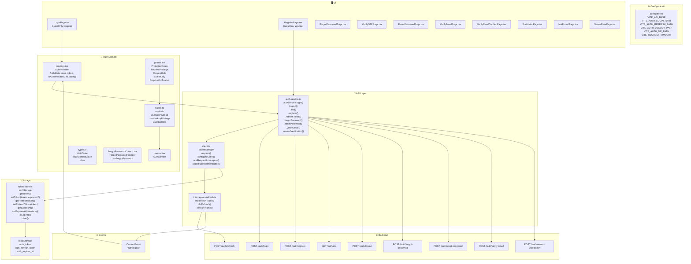

# Diagramas de Autenticación

Diagramas Mermaid generados a partir del código real del sistema de auth.

---

## 1. Vista general — Capas y responsabilidades

```mermaid
flowchart TB
    subgraph UI["🖥️ UI Layer"]
        LoginPage["LoginPage.tsx"]
        RegisterPage["RegisterPage.tsx"]
        ForgotPasswordPage["ForgotPasswordPage.tsx"]
        VerifyOTPPage["VerifyOTPPage.tsx"]
        ResetPasswordPage["ResetPasswordPage.tsx"]
        VerifyEmailPage["VerifyEmailPage.tsx"]
        VerifyEmailConfirmPage["VerifyEmailConfirmPage.tsx"]
        ForbiddenPage["ForbiddenPage.tsx"]
        NotFoundPage["NotFoundPage.tsx"]
        ServerErrorPage["ServerErrorPage.tsx"]
    end

    subgraph Domain["⚙️ Domain Layer"]
        AuthProvider["provider.tsx<br/>AuthProvider"]
        AuthContext["context.tsx<br/>AuthContext"]
        Guards["guards.tsx<br/>ProtectedRoute<br/>RequirePrivilege<br/>RequireRole<br/>GuestOnly<br/>RequireVerification"]
        Hooks["hooks.ts<br/>useAuth<br/>useHasPrivilege<br/>useHasAnyPrivilege<br/>useHasRole"]
        ForgotCtx["ForgotPasswordContext.tsx<br/>ForgotPasswordProvider<br/>useForgotPassword"]
    end

    subgraph Infra["🔌 Infrastructure Layer"]
        Client["client.ts<br/>tokenManager<br/>request()<br/>configureClient()"]
        AuthService["auth.service.ts<br/>authService"]
        RefreshInterceptor["interceptors/refresh.ts<br/>tryRefreshToken()"]
        TokenStore["token-store.ts<br/>authStorage"]
        Env["config/env.ts<br/>env"]
    end

    subgraph Backend["🌐 Backend"]
        LoginAPI["POST /auth/login"]
        RegisterAPI["POST /auth/register"]
        MeAPI["GET /auth/me"]
        RefreshAPI["POST /auth/refresh"]
        LogoutAPI["POST /auth/logout"]
        ForgotAPI["POST /auth/forgot-password"]
        ResetAPI["POST /auth/reset-password"]
        VerifyEmailAPI["POST /auth/verify-email"]
        ResendAPI["POST /auth/resend-verification"]
    end

    LoginPage --> AuthProvider
    RegisterPage --> AuthService
    AuthProvider --> AuthService
    AuthService --> Client
    Client --> RefreshInterceptor
    Client --> TokenStore
    AuthService --> LoginAPI
    AuthService --> RegisterAPI
    AuthService --> MeAPI
    AuthService --> LogoutAPI
    AuthService --> ForgotAPI
    AuthService --> ResetAPI
    AuthService --> VerifyEmailAPI
    AuthService --> ResendAPI
    RefreshInterceptor --> RefreshAPI
    Hooks --> AuthContext
    Guards --> Hooks

    classDef uiStyle fill:#dbeafe,stroke:#3b82f6
    classDef domainStyle fill:#fed7aa,stroke:#f97316
    classDef infraStyle fill:#e9d5ff,stroke:#a855f7
    classDef backendStyle fill:#bbf7d0,stroke:#22c55e

    class LoginPage,RegisterPage,ForgotPasswordPage,VerifyOTPPage,ResetPasswordPage,VerifyEmailPage,VerifyEmailConfirmPage,ForbiddenPage,NotFoundPage,ServerErrorPage uiStyle
    class AuthProvider,AuthContext,Guards,Hooks,ForgotCtx domainStyle
    class Client,AuthService,RefreshInterceptor,TokenStore,Env infraStyle
    class LoginAPI,RegisterAPI,MeAPI,RefreshAPI,LogoutAPI,ForgotAPI,ResetAPI,VerifyEmailAPI,ResendAPI backendStyle
```



---

## 2. Flujo de LOGIN (secuencia)

```mermaid
sequenceDiagram
    autonumber
    participant U as Usuario
    participant LP as LoginPage.tsx
    participant AP as AuthProvider<br/>(provider.tsx)
    participant AS as authService<br/>(auth.service.ts)
    participant C as client.ts<br/>(request())
    participant TS as authStorage<br/>(token-store.ts)
    participant TM as tokenManager<br/>(client.ts)
    participant API as Backend

    U->>LP: Ingresa email + password
    LP->>AP: login(email, password)
    AP->>AS: authService.login(email, password)
    AS->>C: client.post('/auth/login', {email, password})
    C->>API: POST /auth/login
    API-->>C: { success: true, data: { user, token, refreshToken, expiresIn } }
    C-->>AS: ApiResponse&lt;AuthResponse&gt;
    AS-->>AP: { success, data }
    AP->>TS: authStorage.setToken(token, expiresIn)
    AP->>TS: authStorage.setRefreshToken(refreshToken)
    AP->>TM: tokenManager.set(newToken)
    AP->>AP: setState({ user, token, isAuthenticated: true, isLoading: false })
    AP-->>LP: Estado actualizado
    LP->>U: Navigate(from) — Redirect a ruta anterior o /
```

---

## 3. Flujo de 401 → REFRESH → RETRY (secuencia)



---

## 4. Refresh concurrente



---

## 5. Máquina de estados de autenticación



---

## 6. Guards (ProtectedRoute vs GuestOnly vs RequirePrivilege)

```mermaid
flowchart TD
    Start(["Usuario navega a /ruta"]) --> Guard{¿Qué guard<br/>tiene la ruta?}

    Guard -->|ProtectedRoute| PR{isAuthenticated?}
    PR -->|false + isLoading| Loading["Muestra AuthLoading<br/>Verificando sesión..."]
    PR -->|false + !isLoading| CheckVerified{requireVerification<br/>&& !isVerified()?}
    CheckVerified -->|true| VerifyEmail["Navigate → /verify-email"]
    CheckVerified -->|false| Login["Navigate → /login<br/>state={{ from: location }}"]
    PR -->|true| NextGuard{¿Tiene<br/>RequirePrivilege?}

    NextGuard -->|no| Render["Renderiza componente"]
    NextGuard -->|sí| PrivCheck{hasPrivilege<br/>privilege?}
    PrivCheck -->|true| Render
    PrivCheck -->|false| Forbidden["Navigate → /403"]

    Guard -->|GuestOnly| GO{isAuthenticated?}
    GO -->|true| Home["Navigate → /"]
    GO -->|false + isLoading| LoadingGuest["Muestra AuthLoading"]
    GO -->|false + !isLoading| RenderGuest["Renderiza componente"]

    Guard -->|RequireVerification| RV{isVerified?}
    RV -->|true| Render2["Renderiza componente"]
    RV -->|false + !isAuthenticated| LoginRV["Navigate → /login"]
    RV -->|false + isAuthenticated| VerifyEmailRV["Navigate → /verify-email"]

    Guard -->|RequireRole| RR{isAuthenticated?}
    RR -->|false| LoginRR["Navigate → /login"]
    RR -->|true| RoleCheck{hasRole<br/>role?}
    RoleCheck -->|true| Render3["Renderiza componente"]
    RoleCheck -->|false| ForbiddenRR["Navigate → /403"]
```

---

## 7. Ciclo de vida del token



---

## 8. Vista de cajas — Sistema completo



---

## Estado de implementación

| Flujo | Estado | Tests | Notas |
|-------|--------|-------|-------|
| Login | ✅ Completo | ✅ LoginPage.test.tsx | Loading, error, redirect, remember checkbox |
| Register | ✅ Completo | ✅ RegisterPage.test.tsx | Loading, error, redirect a verify-email |
| Forgot Password | ✅ Completo | ✅ ForgotPasswordPage.test.tsx | 3 pasos: email → OTP → reset |
| Verify OTP | ✅ Completo | ✅ ForgotPasswordContext.test.tsx | Conectado a authService.verifyOtp() real |
| Reset Password | ✅ Completo | ✅ ResetPasswordPage.test.tsx | Redirect si no hay token, validación |
| Email Verification | ✅ Completo | ⚠️ Sin tests | Resend + confirm flow |
| Token Refresh | ✅ Completo | ✅ client.test.ts | 401 → refresh → retry, dedup |
| Proactive Refresh | ✅ Completo | ✅ client.test.ts | isExpired() check antes de cada request |
| Guards | ✅ Completos | ✅ index.test.ts | ProtectedRoute, GuestOnly, RequirePrivilege, RequireRole, RequireVerification |
| GuestOnly en rutas públicas | ✅ Completo | N/A | /forgot-password, /verify-otp, /reset-password |
| Timeout | ✅ Completo | ✅ client.test.ts | AbortController con VITE_REQUEST_TIMEOUT |
| Remember Checkbox | ✅ Completo | ✅ token-store.test.ts | localStorage vs sessionStorage |
| Google Sign-in | 🔒 Oculto | N/A | UI deshabilitada hasta tener backend OAuth |
| Barrel Exports | ✅ Completo | ✅ index.test.ts | Todos los componentes públicos exportados |

---

## Discrepancias y observaciones

### ✅ Resueltas

| # | Problema | Estado |
|---|----------|--------|
| 1 | `setToken()` sin `expiresIn` en login | ✅ Resuelto — ahora pasa `expiresIn` |
| 2 | RegisterPage era mock (no llamaba API) | ✅ Resuelto — usa `authService.register()` |
| 3 | ForgotPasswordContext usaba mocks | ✅ Resuelto — `resetPassword` y `verifyOtp` usan authService real |
| 4 | ForgotPasswordPage era mock | ✅ Resuelto — usa `authService.forgotPassword()` |
| 5 | `remember` checkbox no se usaba | ✅ Resuelto — localStorage vs sessionStorage |
| 6 | Google Sign-in es UI estática sin funcionalidad | ✅ Resuelto — oculto de la UI |
| 7 | `VITE_REQUEST_TIMEOUT` no se aplicaba | ✅ Resuelto — AbortController implementado |
| 8 | `RequireVerification` no exportado del barrel | ✅ Resuelto — exportado |
| 9 | `GuestOnly` no envuelve rutas de forgot/OTP/reset | ✅ Resuelto — envueltas con GuestOnly |
| 10 | `authStorage.isExpired()` no se usaba | ✅ Resuelto — usado en request interceptor para refresh proactivo |
| 11 | Tests faltantes en OTP | ✅ Resuelto — ForgotPasswordContext.test.tsx |
| 12 | `verifyOtp()` era mock | ✅ Resuelto — conectado a authService.verifyOtp() real |

### Pendiente — Backend

| # | Problema | Descripción |
|---|----------|-------------|
| 1 | Endpoint `POST /auth/verify-otp` | El frontend está listo, necesita endpoint real en el backend. MSW handler temporal disponible. |

### Pendiente — Frontend (baja prioridad)

| # | Problema | Descripción |
|---|----------|-------------|
| 2 | Tests de guards | Los guards se testean via barrel exports + integración. Tests unitariosson complejos por AuthProvider lifecycle. |
| 3 | Tests de VerifyEmailPage | Flujo completo de verificación de email sin tests unitarios. |

### Comportamiento implícito documentado

1. **`config.onForbidden()` en `client.ts`**: 403 → redirige a `/403`
2. **`location.state.from` en guards**: ProtectedRoute guarda ubicación para redirigir de vuelta después del login
3. **`requireVerification = true` por defecto**: Todas las rutas protegidas requieren email verificado
4. **Proactive refresh**: Antes de cada request, si `isExpired()` retorna true, se intenta refresh antes de enviar
