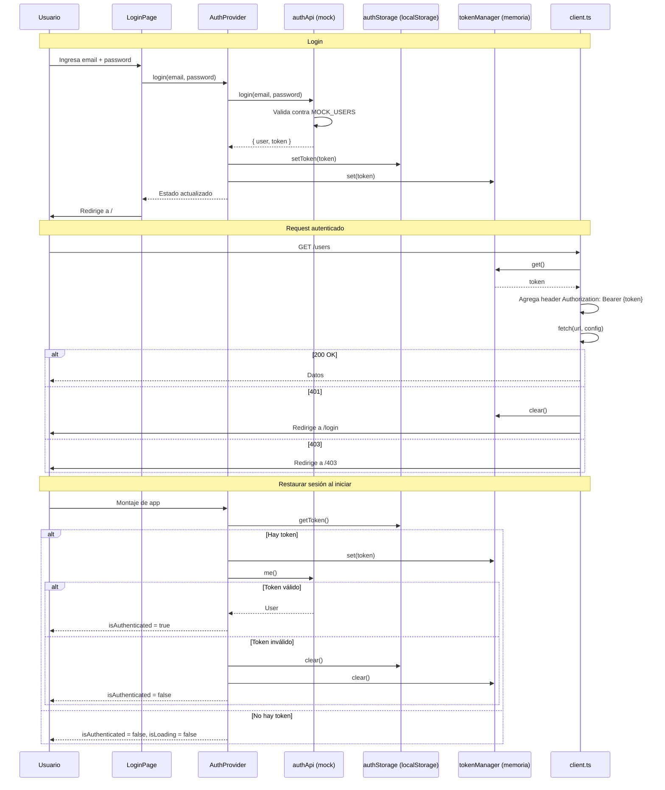
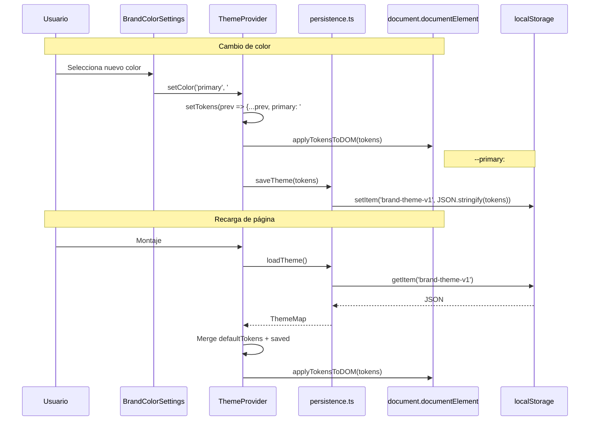
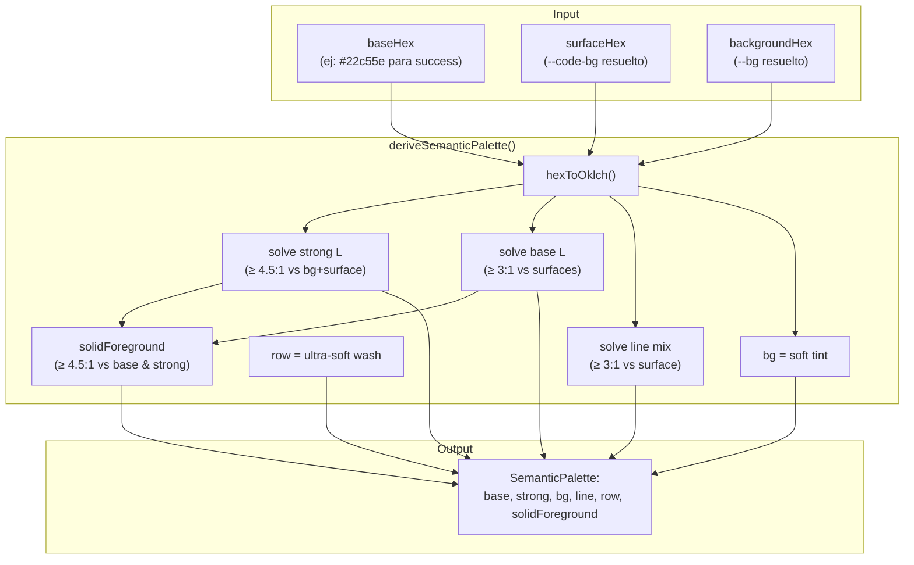
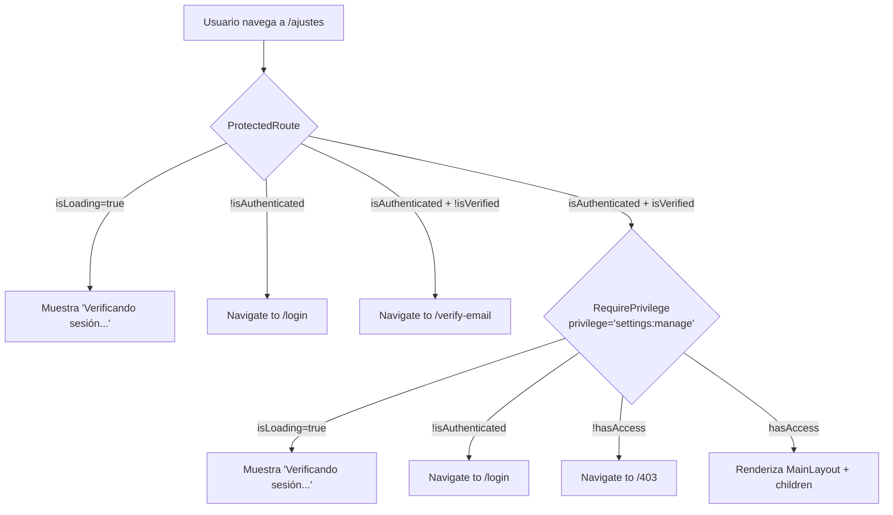
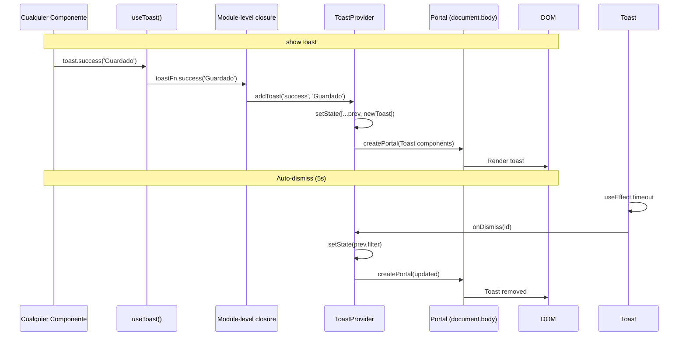
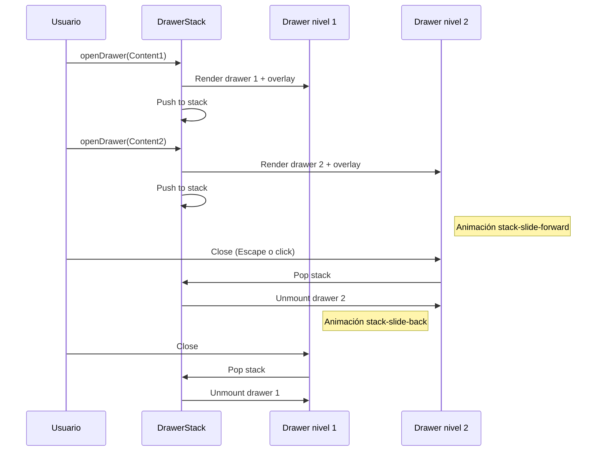
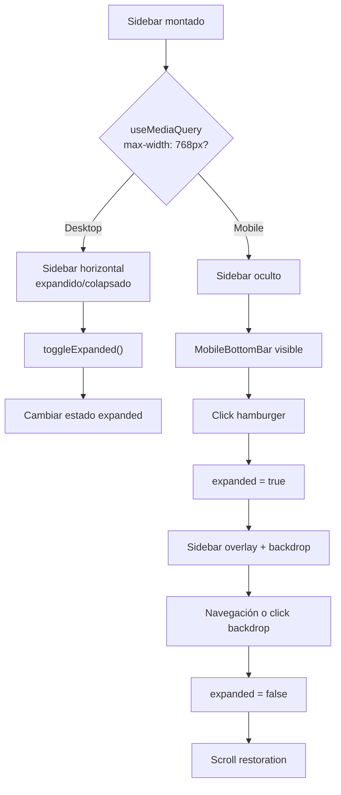

# Flujo de Datos — Semilla Tecnologica

## Flujo de autenticación

## Flujo de theming

## Flujo de paletas semánticas

## Flujo de protección de rutas

## Flujo del Toast system

## Flujo de DrawerStack (multi-level)

## Flujo del Sidebar responsive

