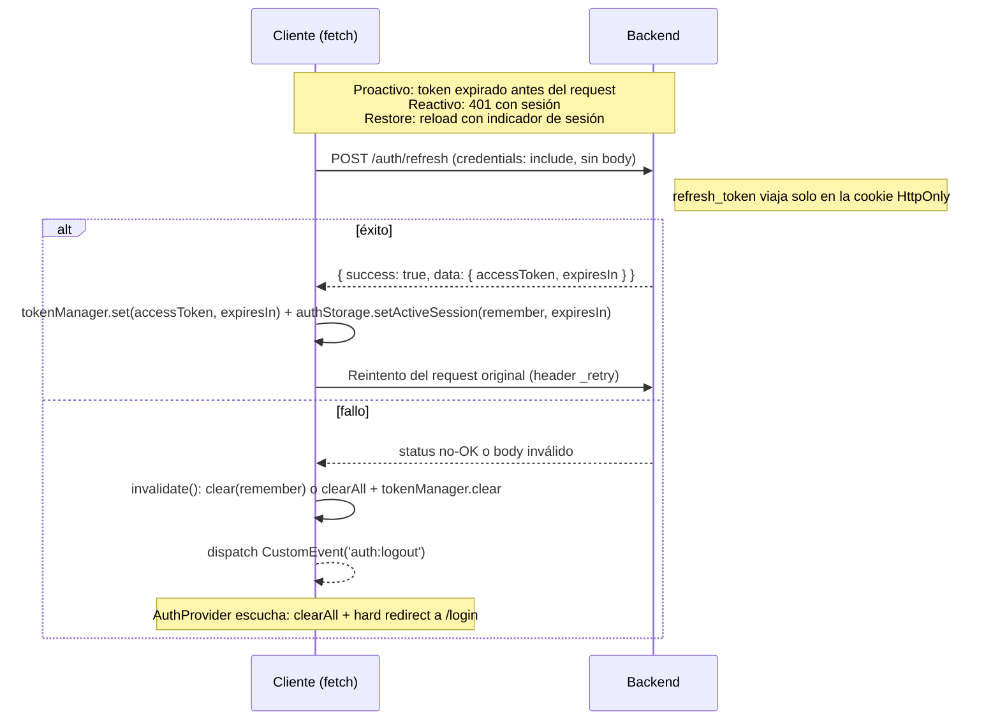
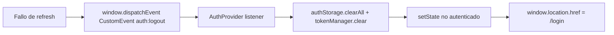

# Arquitectura del módulo de autenticación

Este documento describe los contratos, la persistencia de sesión, los eventos y el flujo de datos del `AuthProvider`.

## Contratos

### Estado de autenticación (`AuthState`)

```ts
interface AuthState {
  user: User | null;
  token: string | null;
  isAuthenticated: boolean;
  isLoading: boolean;
}
```

- `isLoading` inicia en `true` y permanece así hasta que termina la restauración de sesión. Los guards muestran un spinner mientras tanto.
- `User` se re-exporta de `src/lib/api/types/api-response.ts`. El backend retorna `permissions` (no `privileges`):

```ts
interface User {
  id: string;
  email: string;
  name: string;
  roles: string[];
  permissions: string[]; // permisos efectivos (unión de todos los roles)
  isVerified: boolean;
  photoUrl?: string;
}
```

### Valor del contexto (`AuthContextValue`)

Extiende `AuthState` con:

| Miembro | Firma | Comportamiento |
|---|---|---|
| `login` | `(email, password, remember? = true) => Promise<void>` | Llama la API, persiste el token y actualiza el estado. Lanza `Error` con credenciales inválidas. |
| `logout` | `() => Promise<void>` | Llama `authService.logout()` y siempre limpia localmente, aunque la API falle. |
| `hasPrivilege` | `(privilege: string) => boolean` | `user?.permissions.includes(p) ?? false` |
| `hasAnyPrivilege` | `(privileges: string[]) => boolean` | `privileges.some(p => user?.permissions.includes(p)) ?? false` |
| `hasRole` | `(role: string) => boolean` | `user?.roles.includes(role) ?? false` |
| `isVerified` | `() => boolean` | `user?.isVerified ?? false` |

El contexto se crea como `createContext<AuthContextValue | null>(null)`; `useAuth()` lanza `Error` si se consume fuera del provider.

## Persistencia de sesión

### Access token memory-only + cookie HttpOnly

| Artefacto | Dónde vive | Notas |
|---|---|---|
| Access token | Solo en memoria (`tokenManager`) | Nunca se persiste en `localStorage`/`sessionStorage` (mitigación XSS) |
| Indicador de sesión (`auth_expires_at`) | `localStorage` (remember) o `sessionStorage` (sesión de pestaña) | Única clave que se escribe; el storage se decide en el login según `remember` |
| Refresh token | Cookie HttpOnly del backend | Nunca se escribe desde el frontend |
| `auth_token` / `auth_refresh_token` (legacy) | `localStorage`/`sessionStorage` | Claves **legacy**: solo se conservan para borrarlas en `clear()`/`clearAll()`. Nada las escribe ni las lee |

### `authStorage` (`src/lib/auth/token-store.ts`)

| Método | Comportamiento |
|---|---|
| `getActiveSession()` | Resuelve la sesión activa: revisa `sessionStorage` **primero** y `localStorage` después. Devuelve `{ remember }` o `null` (solo el indicador; nunca un token). |
| `setActiveSession(remember = true, expiresIn?)` | Escribe SOLO el indicador `auth_expires_at` en el storage correspondiente. Nunca escribe el access token. |
| `clear(remember = true)` | Limpia **un solo** storage (el indicado por `remember`), incluyendo las claves legacy. |
| `clearAll()` | Limpia **ambos** storages (indicador + claves legacy). |
| `isExpired(remember?)` | Si se omite `remember`, resuelve la sesión activa; sin indicador devuelve `false`. |

> Nota crítica: `clear(remember)` limpia un storage; `clearAll()` limpia ambos. El restore fallido usa `clear(remember)`; login y logout usan `clearAll()`.

### `tokenManager` (`src/lib/api/client.ts`)

| Método | Comportamiento |
|---|---|
| `set(token, expiresIn?)` | Guarda el access token y su expiración SOLO en memoria. |
| `get()` | Devuelve el access token en memoria (o `null`). |
| `isExpired()` | `true` si hay token en memoria y su `expiresAt` ya pasó. |
| `clear()` | Descarta token y expiración de la memoria. |

### Por qué `getActiveSession()` prioriza `sessionStorage`

Una sesión tab-scoped (login sin "Recuérdeme") no debe ser secuestrada por un indicador profile-wide que otro login dejó en `localStorage`. Al restaurar, el provider adopta la sesión **y el storage donde fue creada**.

## Evento `auth:logout`

`window` emite el evento `auth:logout` cuando falla el refresh token (ver `src/lib/api/interceptors/refresh.ts`). El `AuthProvider` lo escucha y:

1. `authStorage.clearAll()` + `tokenManager.clear()`.
2. Resetea el estado a no autenticado.
3. Redirige con `window.location.href = '/login'` (hard redirect intencional: limpia todo el estado de React y fuerza la re-inicialización del provider).

## Flujo de datos del `AuthProvider`

```
Montaje del AuthProvider
        │
        ▼
restoreSession()
  ├─ authStorage.getActiveSession()  →  { remember } | null  (solo indicador)
  ├─ sin indicador        → isLoading=false  (sesión no restaurada)
  ├─ con indicador        → tryRefreshToken()  (POST /auth/refresh con cookie HttpOnly)
  │                          ├─ refresh falla → authStorage.clear(remember) + tokenManager.clear()
  │                          │     → estado no autenticado, isLoading=false
  │                          └─ refresh OK     → token nuevo en memoria (tokenManager.set)
  │                              authService.me()
  │                                ├─ falla (success=false o excepción)
  │                                │     → authStorage.clear(remember) + tokenManager.clear()
  │                                │     → estado no autenticado, isLoading=false
  │                                └─ éxito → estado { user, token, isAuthenticated:true, isLoading:false }
  │
  └─ isLoading=false
```

```
Login(email, password, remember=true)
  ├─ authService.login(email, password)
  │     └─ falla → throw Error(response.message || 'Credenciales inválidas')
  ├─ authStorage.clearAll()                  ← limpia AMBOS storages antes de escribir
  ├─ authStorage.setActiveSession(remember, expiresIn)   ← escribe SOLO el indicador
  ├─ tokenManager.set(token, expiresIn)      ← access token SOLO en memoria
  └─ setState({ user, token, isAuthenticated: true, isLoading: false })

Logout()
  ├─ try   { await authService.logout() }
  └─ finally { authStorage.clearAll(); tokenManager.clear(); estado no autenticado }

Evento 'auth:logout' (fallo de refresh)
  ├─ authStorage.clearAll(); tokenManager.clear()
  ├─ estado no autenticado
  └─ window.location.href = '/login'   ← hard redirect
```

La regla del login es "un login deja exactamente un indicador en exactamente un storage": limpiar ambos antes de escribir evita que un indicador viejo secuestre el restore.

## Diagramas (Mermaid)

### Ciclo de vida de la sesión

```mermaid
flowchart TD
    Start([App inicia]) --> Mount[AuthProvider monta]
    Mount --> Restore{¿authStorage.getActiveSession?}
    Restore -->|sin indicador| Anonymous[isLoading = false<br/>No autenticado]
    Restore -->|con indicador| RefreshRestore[tryRefreshToken<br/>POST /auth/refresh con cookie HttpOnly]
    RefreshRestore -->|falla| ClearRestore[authStorage.clear + tokenManager.clear<br/>No autenticado]
    RefreshRestore -->|éxito| Me[token nuevo en memoria<br/>GET /auth/me]
    Me -->|éxito| Authed[isAuthenticated = true<br/>user cargado]
    Me -->|falla| ClearRestore

    Login([Usuario hace login]) --> Cred[authService.login email+password]
    Cred -->|POST /auth/login| Resp{¿success?}
    Resp -->|no| Throw[throw Error credenciales inválidas]
    Resp -->|sí| Persist[clearAll ambos storages<br/>setActiveSession remember, expiresIn]
    Persist --> Storage{remember?}
    Storage -->|true| LS[localStorage<br/>auth_expires_at (indicador)]
    Storage -->|false| SS[sessionStorage<br/>auth_expires_at (indicador)]
    LS --> Mem[tokenManager.set accessToken + setState autenticado]
    SS --> Mem

    Req([Request con sesión]) --> Exp{¿tokenManager.isExpired?}
    Exp -->|no| Bearer[Inyectar Authorization Bearer]
    Exp -->|sí| Refresh[tryRefreshToken]
    Refresh -->|POST /auth/refresh con credentials include| ROk{¿success?}
    ROk -->|sí| Rotate[tokenManager.set + setActiveSession en MISMO storage]
    Rotate --> Bearer
    ROk -->|no| Invalidate[invalidate + auth:logout]
    Invalidate --> HardRedirect[Hard redirect a /login]

    Out([Logout]) --> Api[try authService.logout]
    Api --> Finally[finally clearAll + tokenManager.clear + no autenticado]
    Finally --> Done([Fin])
```

### Secuencia de refresh de token (cookie HttpOnly)



### Evento `auth:logout`



## Deudas conocidas

- `console.log`/`console.error` de depuración (`[AUTH] ...`) permanecen activos en producción en `provider.tsx` (restore, login y logout).
- En el restore, el provider refresca la sesión vía `POST /auth/refresh` (cookie HttpOnly) y llama `authService.me()` contra el token recién obtenido en memoria; si el refresh falla, se limpia la sesión local y el usuario queda en `/login` sin feedback explícito.