# Flujo de sesión (frontend + backend)

## Resumen

Esta guía unifica el ciclo de vida completo de la sesión entre el frontend React y el backend Spring Boot, desde el login hasta el logout, pasando por la restauración tras recargar la página y la rotación del refresh token. Complementa a [architecture.md](architecture.md) (contratos y persistencia) y a [flows.md](flows.md) (narrativas por flujo individual). El backend corre bajo el context-path `/api` y almacena el hash del refresh token en una cookie HttpOnly, de modo que el token opaco nunca viaja en el payload ni en el storage del navegador; la cookie se emite y se expira con `SameSite=Lax`.

## Diagrama general

El diagrama cubre las cuatro fases del ciclo de vida. Las decisiones de storage (`remember`) y la rotación del refresh token son los puntos donde el frontend y el backend interactúan de forma más estrecha.

```mermaid
sequenceDiagram
    participant U as Usuario
    participant UI as React UI (Login/Vistas)
    participant AC as AuthContext / Hooks
    participant TM as tokenManager (Memoria)
    participant ST as authStorage (LS / SS)
    participant HTTP as Cliente HTTP (Fetch)
    participant API as Backend API (/api/auth)
    participant DB as Base de Datos

    Note over U,DB: Fase 1 — Login y persistencia condicional
    U->>UI: credenciales + remember
    UI->>AC: login(email, password, remember)
    AC->>HTTP: POST /api/auth/login (credentials: include)
    HTTP->>API: POST /api/auth/login
    API->>DB: verifica credenciales (Argon2)
    alt credenciales inválidas
        API--)HTTP: 401
        HTTP--)AC: error visible
    else credenciales correctas
        API->>DB: genera sesión + guarda hash SHA-256 del refresh token
        API--)HTTP: 200 { user, accessToken, expiresIn } + Set-Cookie refresh_token (HttpOnly, Secure, Path=/api/auth, Max-Age=604800, SameSite=Lax)
        HTTP--)AC: 200 { user, accessToken, expiresIn }
        AC->>ST: clearAll() y luego setActiveSession(remember, expiresIn)
        Note over ST: solo el indicador auth_expires_at<br/>localStorage si remember=true<br/>sessionStorage si remember=false
        AC->>TM: set(accessToken, expiresIn)
        AC->>AC: setState autenticado
        AC->>UI: redirige a from o /dashboard
    end

    Note over U,DB: Fase 2 — Montaje / restauración (F5)
    U->>UI: recarga
    UI->>AC: AuthProvider monta
    AC->>ST: getActiveSession() (solo indicador&#59; sessionStorage primero, luego localStorage)
    alt sin indicador
        AC->>AC: isAuthenticated = false, isLoading = false
    else con indicador
        AC->>HTTP: tryRefreshToken() (POST /auth/refresh vía cookie)
        HTTP->>API: POST /api/auth/refresh (sin body ni Bearer&#59; cookie HttpOnly + X-Requested-With)
        API->>DB: valida refresh token y rota la sesión
        alt refresh OK
            API--)HTTP: 200 { accessToken, expiresIn } + cookie rotada
            HTTP->>TM: set(accessToken, expiresIn)
            HTTP->>ST: setActiveSession(remember, expiresIn)
            HTTP--)AC: true
            AC->>HTTP: GET /api/auth/me (Bearer)
            HTTP->>API: GET /api/auth/me
            API->>DB: valida sesión
            alt /me 200
                API--)HTTP: 200 { user }
                HTTP--)AC: 200 { user }
                AC->>AC: setState(user, tokenManager.get()) autenticado
            else /me falla
                AC->>ST: clear(remember)
                AC->>TM: clear()
                AC->>AC: isAuthenticated = false, isLoading = false
            end
        else refresh falla
            HTTP->>ST: clear(remember) o clearAll() (invalidate)
            HTTP->>TM: clear()
            HTTP--)AC: false
            AC->>AC: isAuthenticated = false, isLoading = false
            AC->>UI: guards redirigen a /login
        end
    end

    Note over U,DB: Fase 3 — Token expirado y rotación
    UI->>HTTP: request a recurso protegido
    HTTP->>TM: get()
    alt token expirado (tokenManager.isExpired())
        HTTP->>API: POST /api/auth/refresh (sin body ni Bearer&#59; cookie HttpOnly + X-Requested-With)
        alt refresh OK
            API->>DB: valida token vs hash y rota (markAsUsed, replaced_by, nuevo token)
            API--)HTTP: 200 { accessToken, expiresIn } + cookie rotada
            HTTP->>TM: set(nuevo accessToken, expiresIn)
            HTTP->>ST: setActiveSession(remember, expiresIn)
            HTTP->>API: reintento original con Bearer nuevo
            API--)HTTP: 200 data
            HTTP--)UI: 200 data
        else refresh falla (401)
            API--)HTTP: 401
            HTTP->>ST: invalidate() (clear del storage de la sesión o ambos)
            HTTP->>TM: clear()
            HTTP->>AC: dispatch auth:logout
            AC->>ST: clearAll()
            AC->>TM: clear()
            AC->>UI: hard redirect /login
        end
    else token vigente
        HTTP->>HTTP: inyecta Authorization Bearer
        HTTP->>API: request original
        API--)HTTP: 200 data
        HTTP--)UI: 200 data
    end

    Note over U,DB: Fase 4 — Logout
    U->>UI: clic
    UI->>AC: logout()
    AC->>HTTP: POST /api/auth/logout (Authorization Bearer, credentials: include)
    HTTP->>API: POST /api/auth/logout
    API->>DB: revoca sesión
    API--)HTTP: 200 + Set-Cookie refresh_token vacía (Max-Age=0, mismos atributos, SameSite=Lax)
    HTTP--)AC: 200
    AC->>ST: clearAll()
    AC->>TM: clear()
    AC->>AC: setState unauth (try/finally&#59; la limpieza local ocurre aunque la API falle)
    AC->>UI: redirección SPA a /login
```

## Notas de comportamiento verificadas

- La cookie `refresh_token` almacena el hash SHA-256 del token opaco, nunca el token en claro.
- `SameSite=Lax` se aplica tanto al crear la cookie (login y refresh) como al expirarla (logout).
- El access token es memory-only: vive solo en `tokenManager` y nunca se persiste en `localStorage`/`sessionStorage` (mitigación XSS). En storage solo se escribe el indicador `auth_expires_at`; la clave legacy `auth_token` nunca se escribe y solo se elimina en `clear()`/`clearAll()` (logout o invalidación).
- `POST /auth/refresh` viaja sin body y sin `Authorization`: el refresh token viene en la cookie HttpOnly, que el navegador adjunta con `credentials: 'include'`. Además se envía el header `X-Requested-With: XMLHttpRequest`, exigido por el backend como anti-CSRF.
- En un refresh exitoso, `tryRefreshToken()` también actualiza el indicador de sesión (`authStorage.setActiveSession(remember, expiresIn)`) manteniéndolo en el mismo storage donde se creó: una sesión tab-scoped de `sessionStorage` nunca se promueve a `localStorage`.
- El refresh funciona correctamente; antes un bug de doble hash lo rompía. Reutilizar un token usado o revocado fuera de la ventana de gracia revoca todas las sesiones del usuario (rotación con `@Transactional(noRollbackFor = UnauthorizedException.class)`). Dentro de la ventana de gracia (`auth.refresh.rotation-grace-seconds`, por defecto 10 s) y desde el mismo IP + User-Agent, la reutilización se trata como carrera multi-tab legítima y se rota de nuevo en lugar de revocar todo.
- El header `_retry` se usa únicamente en el reintento reactivo tras un 401 (recursión de `request<T>()`). En la ruta proactiva de la Fase 3 el reintento se reenvía con el Bearer nuevo, sin header extra.
- El usuario no se persiste en storage; se restaura vía `POST /auth/refresh` (cookie HttpOnly) y luego `GET /api/auth/me`.
- `getActiveSession()` prioriza `sessionStorage` para no secuestrar una sesión tab-scoped con un indicador profile-wide.
- El logout del `AuthProvider` usa `try/finally`: la limpieza local (`clearAll()` + `tokenManager.clear()` + estado no autenticado) se ejecuta aunque la llamada a `/api/auth/logout` falle.

## Referencias

- [Arquitectura del módulo de autenticación](architecture.md) — contratos, persistencia de sesión y flujo de datos del `AuthProvider`.
- [Flujos de autenticación](flows.md) — narrativas por flujo (login, registro, logout, restauración).
- [API Client — Arquitectura](../api-client/architecture.md) — pipeline de `request<T>()`, manejo de 401 y refresh proactivo.
- [API Client — Interceptores de refresh](../api-client/interceptors.md) — `tryRefreshToken()`, deduplicación e invalidación.
- El repositorio del backend cuenta con su propia guía de autenticación; no se enlaza desde aquí por tratarse de un repositorio separado.